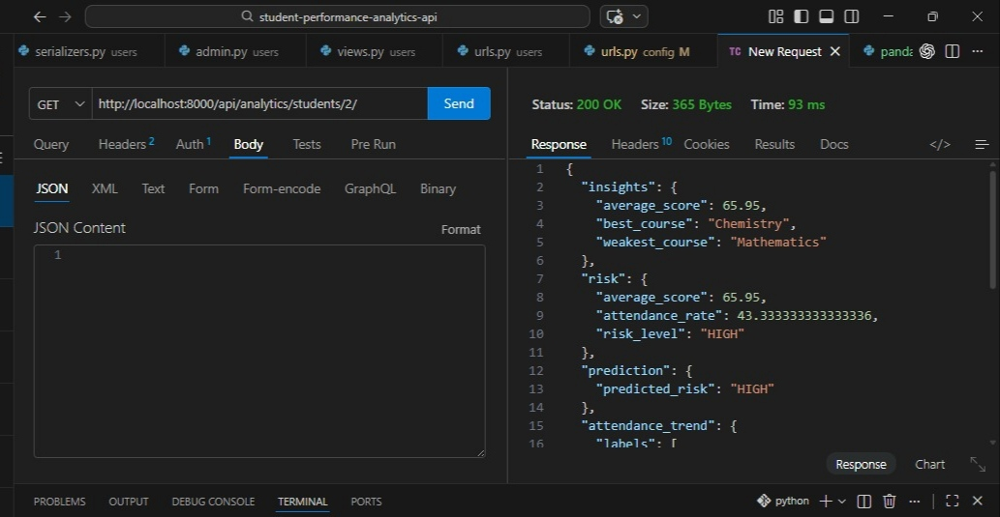
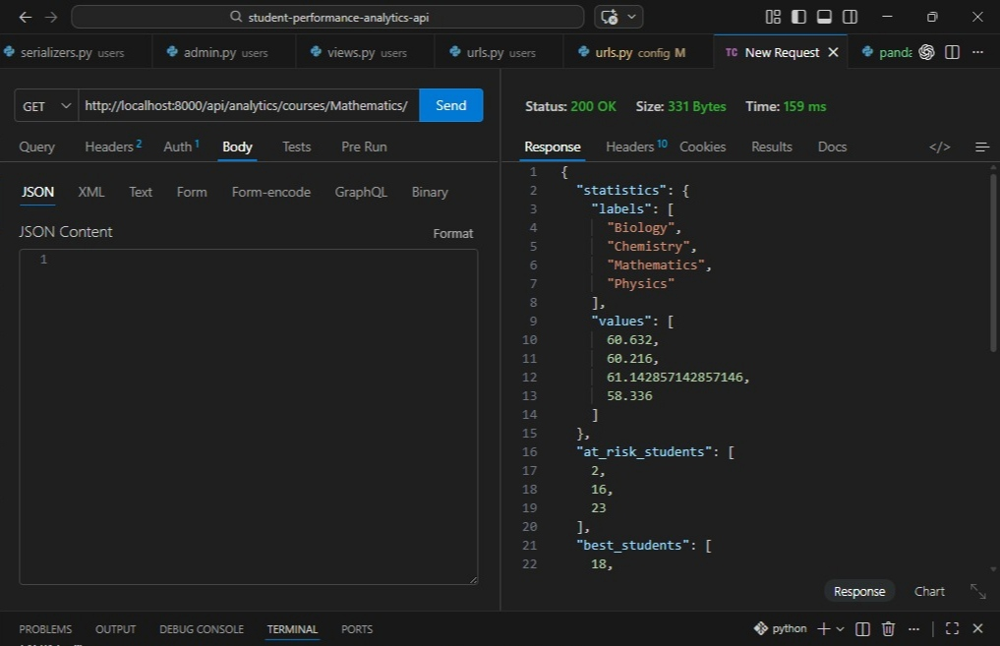
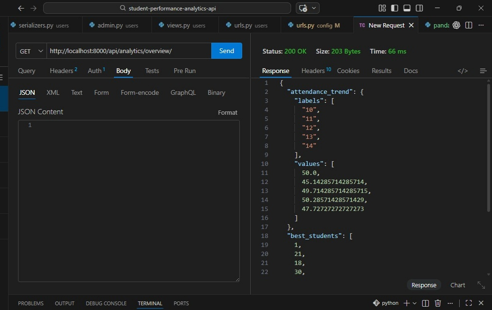

# 🧠 Student Performance & Analytics API

## 📌 Overview
This project is a backend system for managing and analyzing student academic performance.

It was developed as a final project for the FlexiSAF Internship, demonstrating backend engineering, data analytics, and basic machine learning integration.

The system goes beyond CRUD by providing intelligent insights into student performance using Pandas and Scikit-learn.

---

## 🚀 What This Project Does

- Role-based access (Admin, Teacher, Student)  
- Record scores, attendance, courses  
- Auto-create student profiles via signals  
- Analytics using Pandas  
- Risk detection (rule-based + ML)  
- Attendance trends (student, course, global)  

---

## 📊 Core Analytics Capabilities

### 🎓 Student-Level
- Insights → Shows average performance and identifies strongest & weakest subjects  
- Risk detection → Flags students likely to underperform based on score + attendance  
- ML prediction → Uses machine learning to predict future academic risk  
- Attendance trend → Shows consistency over time (weekly attendance %)  

---

### 📚 Course-Level
- Course statistics → Average performance across all students in a course  
- At-risk students → Students struggling in a specific course  
- Best students → Top performers in that course  
- Attendance trend → Engagement level of students taking the course  

---

### 🏫 Global
- Attendance trends → Overall system attendance pattern  
- Best students → Top-performing students across all courses  
- At-risk students → Students performing poorly overall  

---

## 📡 API Endpoints

### 🔐 Auth
```
POST /api/auth/register/     // Register student or teacher
POST /api/auth/login/        // Authenticate user and return JWT
GET /api/auth/me/            // Get current logged-in user details
```

### 📚 Records
```
GET /api/records/students/           // List all student profiles
POST /api/records/courses/           // Create course (Admin only)
GET /api/records/courses/list/       // List all courses
POST /api/records/scores/            // Add student score (Teacher/Admin)
POST /api/records/attendance/        // Record attendance (Teacher/Admin)
```

### 📊 Analytics
```
GET /api/analytics/students/{id}/          // Full student analysis (insights, risk, ML, trends)
GET /api/analytics/courses/{course_name}/  // Course-level analytics
GET /api/analytics/overview/               // Global analytics overview
```

---

## 📸 API Screenshots

### 🎓 Student Analytics


### 📚 Course Analytics


### 🏫 Global Analytics


---

## ⚙️ Tech Stack
```
Django + DRF
SQLite / PostgreSQL
Pandas
Scikit-learn
Docker
JWT Auth
```

---

## ▶️ Local Setup

```
git clone <repo-url>
cd project

python -m venv venv
venv\Scripts\activate

pip install -r requirements.txt

python manage.py migrate
python manage.py createsuperuser
python manage.py runserver
```

### Seed Data
```
python seed_data.py
```

### Run Tests
```
python manage.py test
```

---

## 🐳 Docker Setup

```
docker-compose build
docker-compose up

docker-compose exec web python manage.py migrate
docker-compose exec web python manage.py createsuperuser
docker-compose exec web python seed_data.py
```

---

## ✨ Highlights
- Clean architecture  
- Pandas analytics  
- ML prediction  
- Aggregated APIs  
- Dockerized  

---

## 👨‍💻 Author
Udeagha Mark Mang
